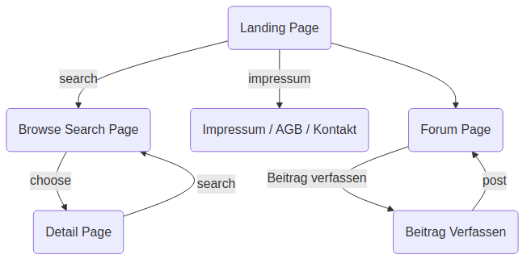
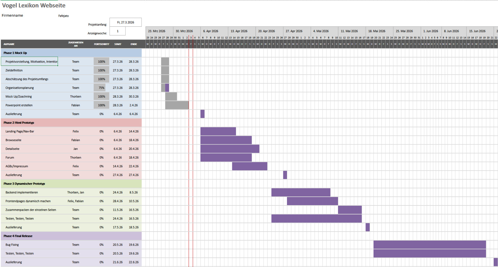

<!-- _class: title -->

# `u.hu` 

##  Ein Lexikon für Vögel und Forum für Vogelsichtung  

> ### Webanwendungen
> Hochschule Albstadt Sigmaringen

## Felix Gaartz, Jan Mihlan, Thorben Müller, Fabian Flad

--- 

<!-- header: '🐦 Unsere Projektidee' -->

# Was ist `u.hu`? 

- Wissensplattform und Lexikon für Vögel
- Aktive Community und Forum für Vogelsichtungen

---

# 💪 Was uns motiviert... 

Wir sind ein junges dynamisches Team, das sich für unsere heimischen Vogalarten begeistert. 

Wir wollen eine Plattform erschaffen, die diese Begeisterung  ins Netzt trägt. Wir wollen ...

- 💡 Wissen zugänglicher zu machen 
- 🫂 Community für Vogelenthusiasten zu schaffen 

---

<!-- header: '🐦 Zieldefinition' -->

Die Website bietet **folgende Funktionen**:

- 🚀 Landing-Page mit Suchfunktion
- 🔎 Ergebnisseite für Suchen
- 🐦 Detail-Seiten für einzelne Vögel
- 💬 Forum für Mitglieder zum Austausch
- 📜 Impressum / AGBs / Kontakt

---

<!-- header: 'Mock Ups' -->

# Systematischer Aufbau von `u.hu`

---

# Entwurf - Landing Page

Landing-Page von `u.hu` mit Suchleiste:

---

# Entwurf - Impressum / Kontakt / AGB Page

---

# Entwurf - Browse Search Page

Diese Seite listet Suchergebnisse auf:

---

# Entwurf - Detail Page

Diese Seite zeigt Detailinformationen zu einzelnen Vögeln an:

---
# Entwurf - Forum Page

 

---
# Entwurf - Forum Eintrag verfassen Page

 

--- 

<!-- header: '🐦 Projektumfang und Organisationsplanung' -->

# Zeitplan

